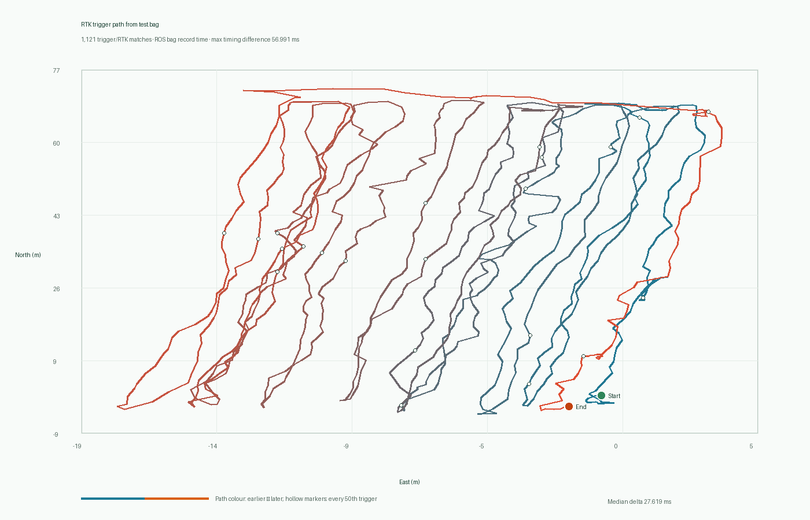

# Online Processing Showcase

PTRDMS can be connected to an upstream ROS1 acquisition platform as an online
panoramic-observation processor. The public demonstration deliberately uses an
image-free timing/path fixture: it shows the synchronization inputs and route
coverage without distributing farm panoramas or claiming field performance.

```text
CompressedImage panorama ─┐
                          ├─► timestamp association ─► reprojection
PoseStamped localization ─┘                              │
                                                         ▼
                           tomato detection + four-stage classification
                                                         │
                                                         ▼
                            /ptrdms/observations + local report artifacts
```

## Runtime interface

[`live_ros.py`](../live_ros.py) subscribes to
`sensor_msgs/CompressedImage` and `geometry_msgs/PoseStamped`. A panorama is
processed only when the pose buffer has a unique nearest timestamp within the
configured `--pose-tolerance-s` window. The timestamp consists of the ROS
header seconds and nanoseconds; `frame_id` is retained as metadata and is not
used as the pose key.

For every accepted frame, the node publishes one JSON `std_msgs/String` on
`/ptrdms/observations` by default. The topic name is configurable through
`--result-topic`. The JSON includes the source timestamp, matched-pose
timestamp, match delta, frame identifier, and the detected observation records.
It also refreshes the same annotated-view, table, and map-report artifacts used
by batch processing in the specified output directory.

## Public evidence fixture

[`evidence/test_bag_path_only`](../evidence/test_bag_path_only) was derived
from the bag timing and localization topics only. Its committed files contain
opaque trigger identifiers, timestamps, and path coordinates; they contain no
camera image bytes. The preview below is a synchronization and route-input
visualization, not a navigation evaluation, a fruit map, or a localization
accuracy result.



Recreate it with:

```bash
python scripts/render_path_evidence.py \
  --input evidence/test_bag_path_only/trigger_pose_trace.csv \
  --output evidence/test_bag_path_only/path_preview.png
```

The result is suitable for illustrating the online data interface. Any use for
row-level association or physical fruit coordinates additionally requires
registered radial-range data and independent validation.
